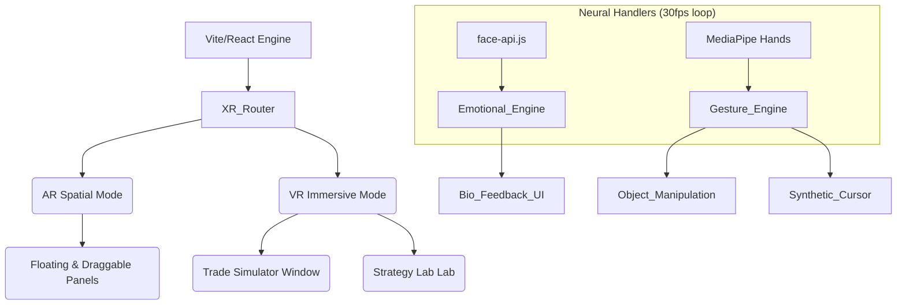
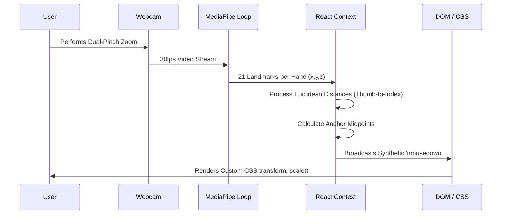

<div align="center">
  

  <h2>An immersive, gesture-controlled Mixed Reality trading platform.</h2>
  
  <p>
    <a href="https://react.dev"></a>
    <a href="https://vitejs.dev"></a>
    <a href="https://www.typescriptlang.org/"></a>
    <a href="https://tailwindcss.com"></a>
    <a href="https://developers.google.com/mediapipe"></a>
  </p>
  
  <p>
    <strong>Trading Sensei XR</strong> transforms your physical desk into a hyper-advanced algorithmic trading battle-station. By utilizing standard webcams and local neural networks, it projects live market data, biometric tracking, and interactive learning environments directly into an Augmented Reality (AR) or Virtual Reality (VR) heads-up display.
  </p>
</div>

---

## 🔥 Key Features

- 🥽 **Dual Modalities (AR / VR)**: Seamlessly toggle between spatial physical passthrough logic (AR) and a dedicated 4-quadrant immersive void (VR) at the push of a button.
- 🖐️ **Minority-Report Gestures**: Powered by Google MediaPipe. Hover over glassmorphic panels, hold a fist for 2 seconds to grab/lock UI, and perform dual-hand pinches to zoom into candlestick charts.
- 🧠 **Biometric Stress Engine**: Real-time localized facial expression tracking (`face-api.js`) monitors trader tilt. Sensei actively intervenes if dangerous tilt/stress thresholds are breached.
- 🎮 **Interactive Market Structure Simulator**: A gamified, Netflix-style branching tutorial teaching Higher-Highs, Higher-Lows, and Break of Structure mechanics.
- 🧪 **Strategy Lab Dashboard**: A sleek, parameter-based backtesting environment featuring real-time expectancy / PNL calculations and deterministic dummy logs.
- 🖱️ **Synthetic Cursor Driver**: Use your primary index finger as a frictionless cursor. Pinch to click elements natively within the 3D space.

---

## 🏗️ Systems Architecture

Trading Sensei XR is built on a unidirectional React data flow, orchestrating massive arrays of high-frequency DOM manipulation without sacrificing framerates. Heavy ML processing is performed frame-by-frame and throttled elegantly mapping to the React Component Tree.



---

## 🖐️ Gesture & Interaction Pipeline

We map abstract 3D hand coordinates into hyper-tactile mathematical triggers. The custom `useGestureCards` hook translates precise Euclidean distances into unified UI states.



---

## 🎨 Design Philosophy

### Monochrome Glassmorphism
The aesthetic revolves around a strict **Monochrome HUD** style using raw HSL tokens and radical WebKit backdrop filters. Color is stripped away to reduce cognitive fatigue, reserving `Green` (Success) and `Red` (Destructive) purely as absolute market signals. 

### JetBrains Mono
Structural markers, timestamps, and active PNL readouts belong purely to the `font-mono` family equipped with intense letter-spacing (`tracking-[0.3em]`) to recreate the feeling of a military-grade aerospace terminal.

---

## 🚀 Getting Started

### Prerequisites
- Node.js (v18 or higher)
- A modern browser with WebRTC (Webcam) support (Chrome / Edge recommended for MediaPipe optimization).

### Local Installation

1. **Clone the repository:**
   ```bash
   git clone https://github.com/tohraan/trading-sensei.git
   cd trading-sensei
   ```

2. **Install dependencies:**
   ```bash
   npm install
   ```

3. **Start the development server:**
   ```bash
   npm run dev
   ```

4. Open your browser and navigate to `http://localhost:5173` (or the port Vite provides).
5. **Approve Webcam Permissions** to immediately initialize the neural engines and enter AR Mode.

---

## 🛠 Tech Stack

| Domain | Technology | Use Case |
| ----------------- | ----------------------- | -------------------------------------------------------- |
| **Core View** | React 18, Vite | Lightning fast rendering, concurrent UI execution |
| **Tracking** | MediaPipe Hands, Face-api | On-device, privacy-centric computer vision AI |
| **Styling** | Tailwind CSS | Utility-first rapid composition, custom `.xr-panel` layers |
| **Charting** | Recharts / SVG Native | High-frequency responsive candlestick graphing |
| **Language** | TypeScript | Strict schema enforcement, complex coordinate math typing |

---

<div align="center">
  <p>Built with precision and discipline. <br/> <b>May the trend be your friend.</b></p>
</div>
